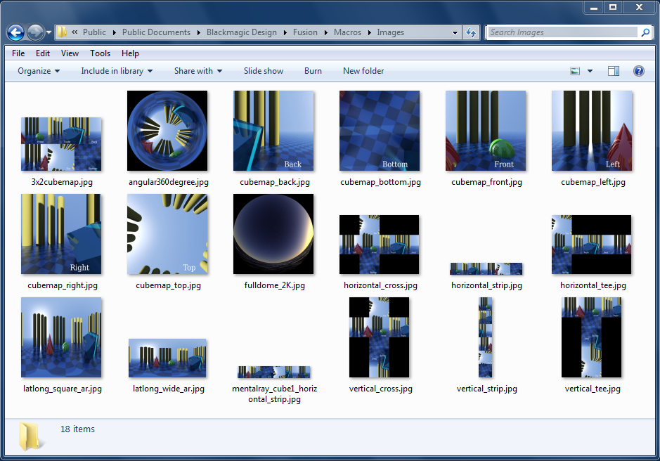

## Sample Imagery ##

Included with the KartaVR is a set of sample panoramic images that can be used to explore the panoramic conversion features.

The sample images are stored in the Fusion 7 on Windows folder:
`C:\Users\Public\Documents\Blackmagic Design\Fusion\Macros\KartaVR\Images`

The sample images are stored in the Fusion 8 on Windows folder:
`%appdata%\Blackmagic Design\Fusion\Macros\KartaVR\Images`

or in the Fusion 8 on macOS folder:

`~/Library/Application Support/Blackmagic Design/Fusion/Macros/KartaVR/Images/`

There is a sample Fusion comp that shows the usage of all of the panoramic images. When you expand the KartaVR.zip file you will find this sample Fusion comp in the folder named `examples`.

Another copy of the sample fusion projects is stored in the Fusion 7 on Windows folder:  
`C:\Users\Public\Documents\Blackmagic Design\Fusion\Macros\KartaVR\Source Compositions\Demos`

or in the Fusion 8 on Windows folder:  
`%appdata%\Blackmagic Design\Fusion\Macros\KartaVR\Source Compositions\Demos`

or in the Fusion 8 on macOS folder:

`~/Library/Application Support/Blackmagic Design/Fusion/Macros/KartaVR/Source Compositions/Demos/`
