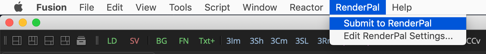
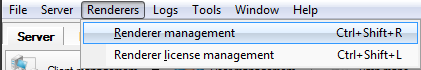
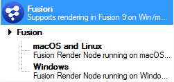
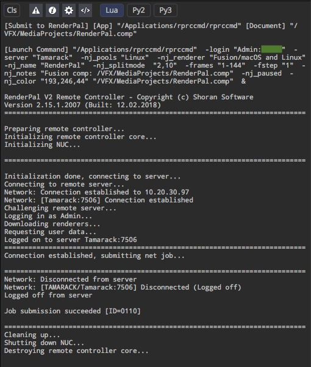
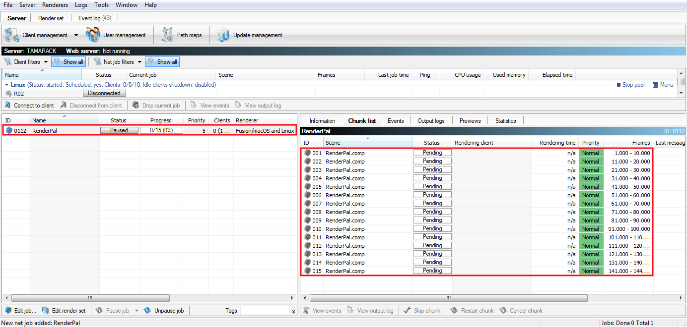

# Submit to RenderPal - v1.1 2018-12-25 #

---
By Andrew Hazelden  
Email: [&lt;andrew@andrewhazelden.com&gt;](mailto:andrew@andrewhazelden.com)  
Web: [https://www.andrewhazelden.com](https://www.andrewhazelden.com)  

## Overview ##

The Fusion 9 based `Submit to RenderPal.fu` menu entry will submit a Fusion 9 comp to the RenderPal client app running on the current system.

This allows Fusion Free v9 and Fusion Studio v9 to both submit jobs for rendering via RenderPal. If you are a Fusion free user this script is especially nice as it will allow to submit your comp render jobs and render them elsewhere on a Fusion Render Node 9 based render farm.

## Installation ##

Step 1. Copy the `Config/Submit to RenderPal.fu` file into your Fusion Free/Fusion Studio 9 `Config:/` PathMap folder.

Step 2. Edit the `Submit to RenderPal.fu` file and change the `renderpalAccount`, `renderpalServer`, and `renderpalPool` variables to use the current settings that were defined in the RenderPal server.

Step 3. Open `RenderPal Server` and edit the `Server > User Management > User Accounts > Admin > Pool access` settings so all the pools are assigned as being accessible to the Admin user.

Step 4. Open `RenderPal Server` and edit the `Renderer > Renderer Management`" settings to remove the old Fusion renderer description.

Import the `RenderPal Renderer Management/Fusion.rren` preset file for Fusion 9 on Windows/macOS/Linux support. This render preset file has the correct dash prefix based command line arguments for macOS and Linux users, along with the traditional Windows slash based command line arguments.

Step 5. Restart Fusion 9 and open a new comp. Select the `RenderPal > Submit to RenderPal` menu item to submit this Fusion composite to your render farm.

After you run the menu item the Fusion Console tab will print out the resulting message that comes back from RenderPal rprcmd:

This is the type of Fusion Console result you will see from a successful job submission:

		[Submit to RenderPal] [App] "/Applications/rprccmd/rprccmd" [Document] "/VFX/MediaProjects/RenderPal.comp"
		
		[Launch Command] "/Applications/rprccmd/rprccmd"  -login "Admin:Passsword"  -server "YourServerName"  -nj_pools "Linux"  -nj_renderer "Fusion/macOS and Linux"  -nj_name "RenderPal"  -nj_splitmode  "2,10"  -frames "1-144"  -fstep "1"  -nj_notes "Fusion comp: /VFX/MediaProjects/RenderPal.comp"  -nj_paused  -nj_color "193,246,44" "/VFX/MediaProjects/RenderPal.comp"  &
		
		RenderPal V2 Remote Controller - Copyright (c) Shoran Software
		Version 2.15.1.2007 (Built: 12.02.2018)
		===========================================================================
		
		Preparing remote controller...
		Initializing remote controller core...
		Initializing NUC...
		
		===========================================================================
		
		Initialization done, connecting to server...
		Connecting to remote server...
		Network: Connection established to 10.20.30.97
		Network: [Tamarack:7506] Connection established
		Challenging remote server...
		Logging in as Admin...
		Downloading renderers...
		Requesting user data...
		Logged on to server Tamarack:7506
		===========================================================================
		Connection established, submitting net job...
		
		===========================================================================
		Network: Disconnected from server
		Network: [YourServerName/YourServerName:7506] Disconnected (Logged off)
		Logged off from server
		
		Job submission succeeded [ID=0111]
		
		===========================================================================
		Cleaning up...
		Shutting down NUC...
		Destroying remote controller core...
		
		[Submit to RenderPal] [App] "/Applications/rprccmd/rprccmd" [Document] "/VFX/MediaProjects/RenderPal.comp"
		
		[Launch Command] "/Applications/rprccmd/rprccmd"  -login "Admin:Password"  -server "YourServerName"  -nj_pools "Linux"  -nj_renderer "Fusion/macOS and Linux"  -nj_name "RenderPal"  -nj_splitmode  "2,10"  -frames "1-144"  -fstep "1"  -nj_notes "Fusion comp: /VFX/MediaProjects/RenderPal.comp"  -nj_paused  -nj_color "193,246,44" "/VFX/MediaProjects/RenderPal.comp"  &
		
		RenderPal V2 Remote Controller - Copyright (c) Shoran Software

Step 6. Your new RenderPal job has been be added to the queue as a paused item. In RenderPal Server or RenderPal Remote Controller you can check the job settings and then "un-pause" the job to start rendering the Fusion composite on your render farm.

## Command Line Options ##

**Tip:** Every single RenderPal job submitter parameter can be defined from the command line with a dash. The frames parameter would be defined using: -frames "1-144"

		# Submit a Fusion comp to RenderPal from macOS
		# (You will need to edit the login name and password, server, pool and Fusion .comp filepath settings)
		"/Applications/rprccmd/rprccmd"  -login "Admin:Password"  -server "YourServerName"  -nj_pools "YourPoolName1;YourPoolName2;YourPoolName3"  -nj_renderer "Fusion/macOS and Linux"  -nj_name "RenderPal-comp"  -nj_splitmode  "2,10"  -frames "1-144"  -fstep "1"  -nj_notes "Fusion comp: /VFX/Media/RenderPal.comp"  -nj_paused  -nj_color "193,246,44" "/VFX/Media/RenderPal.comp"  &

		# Check for available pools
		# "/Applications/rprccmd/rprccmd" -server "YourServerName" -login "Admin:Password" -listpools

		# Check the Fusion renderer for parameters
		# "/Applications/rprccmd/rprccmd" -server "YourServerName" -login "Admin:Password" -listparams "Fusion"

		# Check an existing job
		# "/Applications/rprccmd/rprccmd" -server "YourServerName" -login "Admin:Password" -query "netjob:80"

		# Check for available renderers
		"/Applications/rprccmd/rprccmd" -listrenderers
		
		Renderer list (Group: Renderer/Version):
		----------------------------------------
		Fusion: Fusion/Windows *
		Fusion: Fusion/macOS and Linux

		# Check the available flags
		"/Applications/rprccmd/rprccmd"

		Available options (70):
		-nj_preset *
			Specifies a net job preset to load

		-nj_name
			Sets the net job name

		-nj_priority
			Sets the net job priority (1-10, priority limit might be capped)

		-nj_urgent
		Marks the net job as urgent (requires proper userpermissions)

		-nj_renderer
			Sets the net job renderer; for a complete list of all available renderers, use -listrenderers

		-nj_render32bit
			Enables the use of 32 bit renderers (if neither -nj_render32bit nor -nj_render64bit are specified, both will be used)

		-nj_render64bit
			Enables the use of 64 bit renderers (if neither -nj_render32bit nor -nj_render64bit are specified, both will be used)

		-nj_noemails
			If specified, email notifications for this net job will be disabled

		-nj_emailrecpt
			Specifies additional email recipient emails (separated by semicolons) for the net job

		-nj_emailusers
			Specifies additional email recipient user names (separated by semicolons) for the net job

		-nj_splitmode
			Sets the net job frame splitting mode; Syntax: "Mode,Count". Available modes: 1 = Total pieces, 2 = Frames per job

		-nj_slicemode
			Sets the net job image slicing mode; Syntax: "Mode,X,Y,[Overlap],[Format]". Available modes: 1 = Rows/Cols, 2 = Piece sizes

		-nj_extsplitting
			Specifies parameters used for additional splitting (separated by semicolons)

		-nj_project
			Sets the net job project name

		-nj_notes
			Sets the net job notes

		-nj_tags
			Sets the net job tags (separated by commas or semicolons)

		-nj_pools
			Assigns the specified client pools to the net job separated by semicolons); if no pools are specified, all available will be used

		-nj_paused
			If specified, the net job will be started paused

		-nj_startdate
			Sets the scheduled start date and time of the net job (supports various formats)

		-nj_clientlimit
			Sets the client limit (0 = unlimited)

		-nj_minclientpriority
			Sets the minimum client priority (1-10)

		-nj_minclientmemory
			Sets the minimum client memory (4, 8, 12, 16, 24 or 32 GB)

		-nj_mindispatchdelay
			Sets the minimum dispatching delay between chunks of this jobs in seconds

		-nj_lowerth
			Sets the lower rendering time threshold (minutes)

		-nj_lowerth_sec
			Sets the lower rendering time threshold (seconds)

		-nj_lowerth_action
			Sets the lower rendering time action (0 = restart chunk; 1 = cancel chunk)

		-nj_upperth
			Sets the upper rendering time threshold (minutes)

		-nj_upperth_sec
			Sets the upper rendering time threshold (seconds)

		-nj_upperth_action
			Sets the upper rendering time action (0 = restart chunk; 1 = cancel chunk; 2 = skip chunk)

		-nj_dependency *
			Sets the ID of the net job to render the new job after

		-nj_deptype
			Sets the net job dependency type (0 = Job, 1 = Chunk IDs, 2 = Frames, 3 = Image slices)

		-nj_depunfinishedasdone
			If specified, unfinished jobs will be treated as done when checking net job dependencies

		-nj_framechecking
			Sets the frame checking method; Syntax: "Mode,[Image name],[Image dir],[Filesize threshold],[Recurse subdirs],[Exact match],[Disable subsequent checking]". Available modes: 1 = Job, 2 = Chunk

		-nj_rendercores
			Sets the number of parallel renderings on each client (0 = one per CPU core)

		-nj_dispatchorder
			Sets the chunk dispatch order (0 = Forward, 1 = Backward, 2 = Evenly distributed, 3 = Random)

		-nj_firstlastfirst
			If specified, the first and last chunk of the job will be rendered first

		-nj_color
			Sets the net job color; Syntax: "Red,Green,Blue". Values for RGB range from 0-255

		-nj_blockedclients
			Specifies a list of blocked clients (separated by semicolons)

		-nj_clients
			Specifies a list of admitted clients (separated by semicolons); all other clients will be blocked

		-nj_errorhandling
			Sets the error handling; Syntax: "Mode,Tolerance,[Include recreated chunks]". Available modes: 0 = off, 1 = Cancel job, 2 = Pause job

		-nj_setfield *
			Sets the value of a custom net job field; Syntax: "Name=Value" (for flags, use 'true' or 'false' as the value)

		-nj_caching_mode
			Sets the project files caching mode (0 = Off; 1 = On using renderer settings; 2 = On using job-specific settings)

		-nj_caching_scope
			Sets which parts of a job to cache (1 = scenes; 2 = project directory; 3 = both)

		-nj_caching_addparams
			Adds additional file/path parameters for caching (separated by commas or semicolons)

		-nj_caching_usescenedir
			Specifies whether to use the scene directory if no project directory is specified for caching (Syntax: "Enable,Uplevel")

		-nj_caching_incfilter *
			Adds an include file caching filter (Syntax: "Dir,Patterns,IncludeSubdirs,CreateSymLinks" where patterns is a comma/semicolon-separated list)

		-nj_caching_excfilter *
			Adds an exclude file caching filter (Syntax: "Dir,Patterns,IncludeSubdirs,CreateSymLinks" where patterns is a comma/semicolon-separated list)

		-nj_caching_erraction
			Sets the action to take if rendering using cached files fails (0 = None; 1 = Recache; 2 = Disable; 3 = Both)

		-server
			Specifies the RenderPal V2 server address; overrides the server specified in the configuration file (Syntax: "IP[:Port]")

		-login
			Specifies the user account to use for logging in; overrides the login specified in the configuration file (Syntax: "Username[:Password]")

		-userdir
			Overrides the user directory (the directory where all log files and temporary files will be located)

		-defsection
			Sets the name of the defaults section (RpRcDefaults.conf) to use

		-importset
			Imports all render settings from the specified render set file

		-listrenderers
			Shows a list of all available renderers; a group name can be optionally passed to list only renderers of that group

		-listpools
			Shows a list of all available client pools

		-listparams
			Lists the available render settings for the specified renderer

		-query *
			Queries data from the server; see the RenderPal V2 manual for details

		-control_nj *
			Sends control commands to one or more net jobs; see the RenderPal V2 manual for details

		-control_chunk *
			Sends control commands to one or more net job chunks;see the RenderPal V2 manual for details

		-control_pool *
			Sends control commands to one or more client pools; see the RenderPal V2 manual for details

		-execute
			Executes a command on a list of clients and pools; see the RenderPal V2 manual for details

		-execute_idleonly
			executed on idle clients

		-nodefaults
			If specified, no renderer defaults for parameters will be used

		-compact
			Strips all extra information from the output (makes parsing the output easier)

		-retnjid
			When specified, the RC will return the ID of the new net job instead of an error code

		-log
			Enables logging of all output to a log file (RpRcCmd.log)

		-help
			Shows this help
