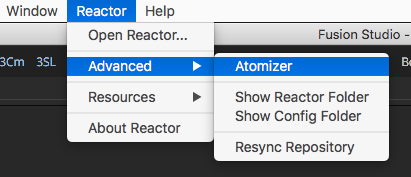

# Table Of Contents #

- [Creating Atom Packages](Creating-Atom-Packages.md#creating-atom-packages)
	- [Adding a Description to an Atom Package](Creating-Atom-Packages.md#adding-a-description-to-an-atom-package)
	- [Adding Emoticon Images to the Description](Creating-Atom-Packages.md#adding-emoticon-images-to-the-description)
	- [Using Atomizer to Edit Your Atoms](Creating-Atom-Packages.md#using-atomizer-to-edit-your-atoms)
	- [Adding a Category to an Atom Package](Creating-Atom-Packages.md#adding-a-category-to-an-atom-package)
	- [Adding a Required Donation to an Atom Package](Creating-Atom-Packages.md#adding-a-required-donation-to-an-atom-package)
		- [PayPal.me Links](Creating-Atom-Packages.md#paypal-me-links)
		- [WWW Links](Creating-Atom-Packages.md#www-links)
		- [Email Links](Creating-Atom-Packages.md#email-links)
		- [Bitcoin Links](Creating-Atom-Packages.md#bitcoin-links)
	- [Adding a Deploy Platform Requirement](Creating-Atom-Packages.md#adding-a-deploy-platform-requirement)
		- [Platform Specific Deploy Entries](Creating-Atom-Packages.md#platform-specific-deploy-entries)
	- [Adding a Package Dependency](Creating-Atom-Packages.md#adding-a-package-dependency)
	- [Adding Documentation](Creating-Atom-Packages.md#adding-documentation)

# Creating Atom Packages #

An atom package is used to define a new installable item that is accessible in the Reactor package manager. 

This is a visual image of what a new atom package folder could look like:

A Reactor atom package is arranged with a basic file hierarchy like this:

			com.YourCompanyName.YourPackageName (folder)
					com.YourCompanyName.YourPackageName.atom (file)
					Macros	(folder)
							YourCompanyName (folder)
									your-custom.bmp (file)
									your-custom.setting (file)
					Fuses (folder)
							your-custom.fuse (file)
					Scripts (folder)
							Comp (folder)
									YourCompanyName (folder)
											your-script.lua (file)

The `com.YourCompanyName.YourPackageName.atom` file contents would look like this:

			Atom {
				Name = "YourPackageName",
				Category = "Tools",
				Author = "YourCompanyName",
				Version = 1.0,
				Date = {2017-11-18},

				Description = [[A minimal Reactor example atom package.]],

				Deploy = {
					"Macros/YourCompanyName/your-custom.setting",
					"Fuses/your-custom.fuse",
					"Scripts/Comp/YourCompanyName/your-script.lua",
				},

				Dependencies = {
					"com.wesuckless.Switch",
				},
			}

You only need to add the intermediate folders required for the content your atom is installing. This means if you are creating an Atom package for delivering a Macro, you only need to add a "Macros/" folder and "Deploy" entry for the .setting file and its thumbnail bin icon.

## Adding a Description to an Atom Package ##

When creating a Atom file Description entry you should place the text inside a pair of double square brackets `[[Your Description Text]]` so Lua will fully escape the quote characters and other symbols.

`Description = [[A minimal "FUZIONMONGER" Reactor example atom package description.]],`

You are able to use HTML formatted text in the description field like:

`
This is a new paragraph of text
`

or 

`<pre>This looks like monospaced source code</pre>`

You can also create an HTML ordered list of items in the description field using:

			Description = [[
YourPackageName includes support for:

			<ul>
			<li>Note 1</li>
			<li>Note 2</li>
			<li>Note 3</li>
			<li>Note 4</li>
			</ul>]],

This HTML formatting creates an Atom description entry like:

YourPackageName includes support for:

- Note 1
- Note 2
- Note 3
- Note 4

The rich text formatting capability is possible since the description GUI element is created using a Fusion 9 ui:TextEdit field (which is internally done as a QTextEdit item). This means you can read the QT documentation on rich text HTML tags to see what [HTML formatting tags](http://doc.qt.io/qt-4.8/richtext-html-subset.html) can be used. 

If you want to insert a `<` character in the description you should use the HTML encoded "entity" version `<`. If you want to insert a `>` character in the description you should use the HTML encoded "entity" version `>`. The copyright symbol would be added using the HTML encoded "entity" version `&copy;`. You can read a summary of [HTML 4 style encoded entities](https://www.w3schools.com/html/html_entities.asp) here.

When adding html tags to the description text, you are unable to add any `` image tags that use an external (http) based internet URL. Also any `` links added in the description field will not be clickable. 

### Adding Emoticon Images to the Description ###

The atom description field supports the insertion of HTML based smilie/emoticon images. You have 18 different images to choose from:

The way you add an emoticon to the HTML code in your description field is by using the following HTML "img" tag syntax:

			
			
			
			
			
			
			
			
			
			
			
			
			
			
			
			
			
			

The emoticon PNG images are stored in the Reactor managed "Reactor:/UI/Emoticons/" folder.

### Using Atomizer to Edit Your Atoms ###

The Atomizer editing tool is an atom package editor that is built into Reactor. Atomizer is able to preview your HTML based description field content including your headings, paragraphs, bold, italics, lists, tables, and even emoticon images. Using the Atomizer tool to prepare your atom packages makes it a lot easier to see what your atom package descriptions will look like with the help of an interactive live HTML preview window that show edits instantly as you type.

You can access Atomizer using the **Reactor > Advanced > Atomizer** menu item.

When Atomizer loads you are presented with a Welcome screen. You can use this window to either open up an existing atom package with the "Open Atom Package" button, or you can click the "Create New Atom Package" button to start preparing your own content for submission to Reactor. 

The **Create New Atom Package from Clipboard** option on the welcome screen is interesting if you have a lot of similar atoms to prepare as you can copy the text from an existing .atom file into your clipboard copy/paste buffer and then use that information as the basis for creating each of your new atoms. 

When you click the **Create New Atom Package from Clipboard** button your clipboard contents is pre-filled into the fields in the editing window. Note: Sometimes you might have to click this button a few times for Fusion to read the latest clipboard data and proces the information. If there is an issue with the text in your clipboard you will see the output details in the Console tab.

Let's take a look at the main Atomizer window. This view is the heart of the Atomizer tool. It is where the atom editing occurs. Your atom descriptions are typed into the **HTML Code Editor** part of the user interface.

The **Author** text field is for entering your personal or company name.

The **Package Name** text field is used for the name of the atom as it will be shown to the end user inside of the Reactor package manager window.

The **Version** field holds a floating point number like 1.2

The **Category** combo control menu is used to define the purpose of your atom and where it will show up inside of Reactor.

The **Date** Fields are where you can specify what the original release date was for the current version of your tool. You can either enter the date manually in the Year - Month - Day (YYYY)-(MM)-(DD) textfields, or you can simply press the "Today" button to enter today's date.

The **Deploy** text fields are where the content to be installed by Reactor is listed. The Common (No Architecture) text field is where material like fuses, macros, and scripts are added that work across all of Fusions supported os platforms. If you are deploying a plugin that only works on a specific OS platform you can enter that file in the appropriate heading like "Windows", "Mac", or "Linux".

To the far right of the Deploy section in the editing GUI is a **Refresh** icon that looks like a pair of spinning arrows. You can press that button to instantly refresh the entries in the Deploy fields based upon the content in your Atom package folder. The "Refresh" button doesn't automatically save this edit to the atom file so you can close the Atomizer window with the **Close Atom** button if you don't like the changes that have been made to the Deploy list.

The **Dependencies** section lets you list other Reactor atom packages that are required inorder for your atom to function correctly. These items will be installed automatically by Reactor when an end user chooses to add your atom to their system.

After you have edited the atom package you can press the **Save Atom** button to write these changes to disk.

The **View Raw Text** button shows a plain text code view window that lets you see the raw atom formated package file.

The **Close Atom** button will exit the editing process for your current atom package file. Any unsaved edits in this window will be discarded. You are also able to close any of the Atomizer windows using the Control+W (Win/Linux) or Command+W (Mac) hotkeys.

## Adding a Category to an Atom Package ##

When creating an Atom package it helps to look over the existing **Category** entries in the Reactor GUI to see if something appropriate exists before you create a new category that performs a similar task.

Here is a quick summary of the typical Reactor categories you can choose from:

- Bin
- Brushes
- Comps
- Comps/Templates
- Console
- Docs
- Fun
- LUTs
- Menus
- Modifiers
- Modules
- Scripts
- Scripts/Bin
- Scripts/Comp
- Scripts/Job
- Scripts/Slave
- Scripts/Reactor
- Scripts/Tool
- Scripts/Utility
- Scripts/Views
- Testing
- Tools
- Tools/3D
- Tools/Color
- Tools/Composite
- Tools/Creator
- Tools/Effect
- Tools/Filter
- Tools/Flow
- Tools/Miscellaneous
- Tools/Optical Flow
- Tools/Particles
- Tools/Plugins
- Tools/Tracking
- Tools/Warp
- Viewshaders

## Adding a Required Donation to an Atom Package ##

If you want to mark your Atom package as having a required (suggested) donation you can add the following Donation tag inside the `Atom {}` code block.

### PayPal.me Links ###

A Donation tag with a [PayPal.me](https://www.paypal.me/) based www link:

			Atom {
				Donation = {
					URL = [[http://www.paypal.me/andrewhazelden]],
					Amount = "$5.00 USD",
				},
			}`

This is a preview of the PayPal.me based donation link in the Reactor UI:

When the Paypal.me link is clicked in the dialog you are then brought to a PayPal payment webpage that looks like this:

### WWW Links ###

A Donation tag with an HTTP based www link:

			Atom {
				Donation = {
					URL = [[http://www.yourcompany.com/Products/YourPackageName/]],
					Amount = "$5.00 USD",
				},
			}

### Email Links ###

A Donation tag with an email `mailto:` link:

			Atom {
				Donation = {
					URL = [[mailto:you@yourcompany.com]],
					Amount = "$5.00 USD",
				},
			}

### Bitcoin Links ###

A Donation tag with a bitcoin link should generally use the [Bitcoin URI scheme BIP21](https://en.bitcoin.it/wiki/BIP_0021):

			Atom {
				Donation = {
					URL = [[bitcoin:<myaddress>?amount=1&message=mymsg]],
					Amount = "$5.00 USD",
				},
			}

## Adding a Deploy Platform Requirement ##

The Deploy tag allows you to have files defined as being shared across all OS platforms, or files can be defined as being Windows/Mac/Linux platform dependent. 

When you enter a specific platform entry in the Deploy tag those resources will only be installed by Reactor if it is running on that platform. This is handy if you have included customized versions of a script, resource, compiled command line tools, .dll/.so/.dylib library, or a Lua binary module for a specific OS platform.

All filepaths entires that are specified inside a `Deploy` tag are going to be installed to following PathMap folder location on disk:

`AllData:/Reactor/Deploy/`

The `AllData:/Reactor/Deploy/` PathMap location translates to:

**Windows Deploy Path:**

`C:\ProgramData\Blackmagic Design\Fusion\Reactor\Deploy\`

**Mac Deploy Path:**

`/Library/Application Support/Blackmagic Design/Fusion/Reactor/Deploy/`

**Linux Deploy Path:**

`/var/BlackmagicDesign/Fusion/Reactor/Deploy/`

When an Atom package is installed in Reactor by an end user a copy of the .atom file will be placed in the folder:

`AllData:/Reactor/Deploy/Atoms/Reactor/`

Here is an example of a deploy tag with platform specific definitions:

			Atom {
				Deploy = {
					"Scripts/Comp/YourCompanyName/your-shared-script.lua"
					"Scripts/Comp/YourCompanyName/another-shared-script.lua"
					"Scripts/Comp/YourCompanyName/yet-another-shared-script.lua"

					Windows = {
						"Scripts/Comp/YourCompanyName/WindowsOnly.lua",
					},
				
					Mac = {
						"Scripts/Comp/YourCompanyName/MacOnly.lua",
					},
				
					Linux = {
						"Scripts/Comp/YourCompanyName/LinuxOnly.lua",
					},
				},
			}

In this deploy example, the `your-shared-script.lua`, `another-shared-script.lua`, and `yet-another-shared-script.lua` entries are installed on all platforms.

The `WindowsOnly.lua` script is installed only if Reactor is running on a Windows system.

The `MacOnly.lua` script is installed only if Reactor is running on a Mac system.

The `LinuxOnly.lua` script is installed only if Reactor is running on a Linux system.

### Platform Specific Deploy Entries ###

It is important to know that a set of platform specific deploy entries that are listed in the Atom file like this:

			Windows = {
				"Scripts/Comp/YourCompanyName/WindowsOnly.lua",
			},
			Mac = {
				"Scripts/Comp/YourCompanyName/MacOnly.lua",
			},
			Linux = {
				"Scripts/Comp/YourCompanyName/LinuxOnly.lua",
			},

Will end up being be stored in the Atom folder hierarchy on disk like this:

			com.YourCompanyName.YourPackageName/Windows/Scripts/Comp/YourCompanyName/WindowsOnly.lua
			com.YourCompanyName.YourPackageName/Mac/Scripts/Comp/YourCompanyName/MacOnly.lua
			com.YourCompanyName.YourPackageName/Linux/Scripts/Comp/YourCompanyName/LinuxOnly.lua

A platform specific deploy file needs to be stored inside of a folder with the intermediate folder name of "Windows", "Mac", and "Linux". This is due to the way most Fusion plugins have the same filename on Windows/Mac/Linux.

A custom compiled Fusion plugin you create would be called `Your-Custom.plugin` on all three supported Fusion OS platforms.

## Adding a Package Dependency ##

You can mark your atom package as having a dependency on another Atom package.

If you add a Dependencies tag, when your Atom package is selected for installation, Reactor will automatically install each of those dependencies at the same time as your atom.

			Atom {
				Dependencies = {
					"com.wesuckless.SlashCommand",
				},
			}

At this current time, Reactor will not remove the dependent Atom packages that are installed automatically when remove the original base package you selected.

## Adding Documentation ##

If you want to add a single page HTML or Markdown formatted documentation file to your atom package you can do that by adding an entry in your Deploy section. This will install your documentation file to the `Reactor:/Deploy/Docs/` folder.

HTML:

				Deploy = {
					"Docs/com.YourCompanyName.YourPackageName.html"
				},

Markdown:

				Deploy = {
					"Docs/com.YourCompanyName.YourPackageName.md"
				},

Then if you want to link to your local documentation file from your Script/Macro/Plugin the PathMap address would be:

				Reactor:/Deploy/Docs/com.YourCompanyName.YourPackageName.html

Last Revised 2018-01-21 
