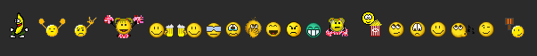
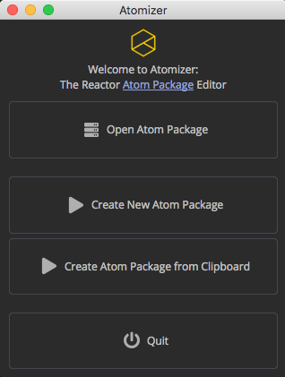
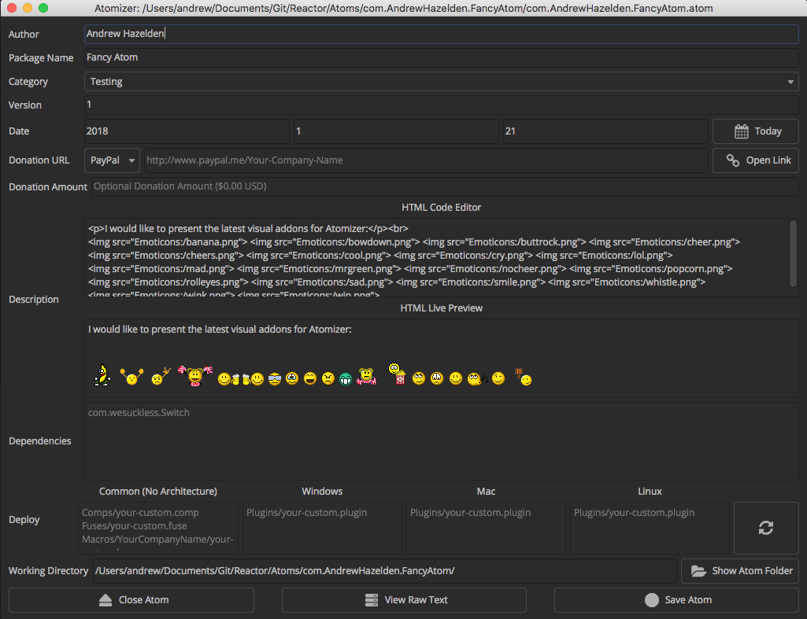
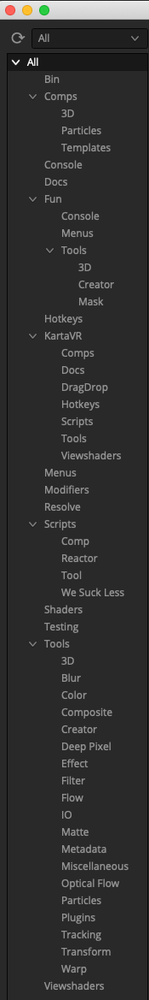
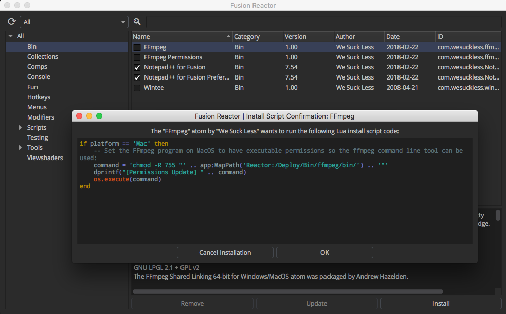

# Table Of Contents #

- [Creating Atom Packages](Creating-Atom-Packages.md#creating-atom-packages)
	- [Adding a Description to an Atom Package](Creating-Atom-Packages.md#adding-a-description-to-an-atom-package)
	- [HTML Encoded Entity Characters](Creating-Atom-Packages.md#html-encoded-entity-characters)
	- [Adding Emoticon Images to the Description](Creating-Atom-Packages.md#adding-emoticon-images-to-the-description)
	- [Using Atomizer to Edit Your Atoms](Creating-Atom-Packages.md#using-atomizer-to-edit-your-atoms)
	- [Adding a Category to an Atom Package](Creating-Atom-Packages.md#adding-a-category-to-an-atom-package)
	- [Adding a Required Donation to an Atom Package](Creating-Atom-Packages.md#adding-a-required-donation-to-an-atom-package)
		- [PayPal.me Links](Creating-Atom-Packages.md#paypal-me-links)
		- [WWW Links](Creating-Atom-Packages.md#www-links)
		- [Email Links](Creating-Atom-Packages.md#email-links)
		- [Bitcoin Links](Creating-Atom-Packages.md#bitcoin-links)
	- [Adding a Deploy Platform Requirement](Creating-Atom-Packages.md#adding-a-deploy-platform-requirement)
		- [Platform Specific Deploy Entries](Creating-Atom-Packages.md#platform-specific-deploy-entries)
		- [Host App Specific Deploy Entries](Creating-Atom-Packages.md#host-app-specific-deploy-entries)
	- [Adding a Package Dependency](Creating-Atom-Packages.md#adding-a-package-dependency)
	- [Adding Documentation](Creating-Atom-Packages.md#adding-documentation)
	- [Adding Fusion Minimum/Maximum Compatibility](Creating-Atom-Packages.md#adding-fusion-minimum-maximum-compatibility)
	- [InstallScripts and UninstallScript](Creating-Atom-Packages.md#installscripts-and-uninstallscripts)
		- [UI Manager GUIs](Creating-Atom-Packages.md#ui-manager-guis)
		- [Create Shortcut Function](Creating-Atom-Packages.md#create-shortcut)

# Creating Atom Packages #

An atom package is used to define a new installable item that is accessible in the Reactor package manager.

This is a visual image of what a new atom package folder could look like:

A Reactor atom package is arranged with a basic file hierarchy like this:

			com.YourCompanyName.YourPackageName (folder)
					com.YourCompanyName.YourPackageName.atom (file)
					Macros	(folder)
							YourCompanyName (folder)
									your-custom.bmp (file)
									your-custom.setting (file)
					Fuses (folder)
							your-custom.fuse (file)
					Scripts (folder)
							Comp (folder)
									YourCompanyName (folder)
											your-script.lua (file)

The `com.YourCompanyName.YourPackageName.atom` file contents would look like this:

			Atom {
				Name = "YourPackageName",
				Category = "Tools",
				Author = "YourCompanyName",
				Version = 1.0,
				Date = {2017-11-18},

				Description = [[A minimal Reactor example atom package.]],

				Deploy = {
					"Macros/YourCompanyName/your-custom.setting",
					"Fuses/your-custom.fuse",
					"Scripts/Comp/YourCompanyName/your-script.lua",
				},

				Dependencies = {
					"com.wesuckless.Switch",
				},
			}

You only need to add the intermediate folders required for the content your atom is installing. This means if you are creating an Atom package for delivering a Macro, you only need to add a "Macros/" folder and "Deploy" entry for the .setting file and its thumbnail bin icon.

## Adding a Description to an Atom Package ##

When creating a Atom file Description entry you should place the text inside a pair of double square brackets `[[Your Description Text]]` so Lua will fully escape the quote characters and other symbols.

`Description = [[A minimal "FUZIONMONGER" Reactor example atom package description.]],`

You are able to use HTML formatted text in the description field like:

`
This is a new paragraph of text
`

or

`<pre>This looks like monospaced source code</pre>`

You can also create an HTML ordered list of items in the description field using:

			Description = [[
YourPackageName includes support for:

			<ul>
			<li>Note 1</li>
			<li>Note 2</li>
			<li>Note 3</li>
			<li>Note 4</li>
			</ul>]],

This HTML formatting creates an Atom description entry like:

YourPackageName includes support for:

- Note 1
- Note 2
- Note 3
- Note 4

The rich text formatting capability is possible since the description GUI element is created using a Fusion 9 ui:TextEdit field (which is internally done as a QTextEdit item). This means you can read the QT documentation on rich text HTML tags to see what [HTML formatting tags](http://doc.qt.io/qt-4.8/richtext-html-subset.html) can be used.

### HTML Encoded Entity Characters ###

If you want to insert a `<` character in the description you should use the HTML encoded "entity" version `&lt;`. If you want to insert a `>` character in the description you should use the HTML encoded "entity" version `&gt;`.

The copyright symbol would be added using the HTML encoded "entity" version `&copy;`.

If you need to write multiple square brackets in an atom file's HTML based description tag, the easiest and most reliable approach is to use the HTML encoded symbol for the characters:

`[` has an HTML encoded format of `&#91;`
`]` has an HTML encoded format of `&#93;`

If you wanted to write in "`Well [[hello]] there!`" in the text part of the atom description text field that could be entered as:

				Well &#91;&#91;hello&#93;&#93; There!

You can read a summary of [HTML 4 style encoded entities](https://www.w3schools.com/html/html_entities.asp) here.

When adding html tags to the description text, you are unable to add any `` image tags that use an external (http) based internet URL. Also any `` links added in the description field will not be clickable.

### Adding Emoticon Images to the Description ###

The atom description field supports the insertion of HTML based smilie/emoticon images. You have 19 different images to choose from:

The way you add an emoticon to the HTML code in your description field is by using the following HTML "img" tag syntax:

			
			
			
			
			
			
			
			
			
			
			
			
			
			
			
			
			
			
			
			
			
			
			
			
			
			
			
			
			
			
			
			
			
			
			
			

The emoticon PNG images are stored in the Reactor managed "Reactor:/UI/Emoticons/" folder.

### Using Atomizer to Edit Your Atoms ###

The Atomizer editing tool is an atom package editor that is built into Reactor. Atomizer is able to preview your HTML based description field content including your headings, paragraphs, bold, italics, lists, tables, and even emoticon images. Using the Atomizer tool to prepare your atom packages makes it a lot easier to see what your atom package descriptions will look like with the help of an interactive live HTML preview window that show edits instantly as you type.

You can access Atomizer using the **Reactor > Tools > Atomizer** menu item.

When Atomizer loads you are presented with a welcome screen. You can use this window to either open up an existing atom package with the "Open Atom Package" button, or you can click the "Create New Atom Package" button to start preparing your own content for submission to Reactor.

The **Create New Atom Package from Clipboard** option on the welcome screen is interesting if you have a lot of similar atoms to prepare as you can copy the text from an existing .atom file into your clipboard copy/paste buffer and then use that information as the basis for creating each of your new atoms.

When you click the **Create New Atom Package from Clipboard** button your current copy/paste clipboard data is pre-filled into the Atomizer fields in the editing window. Note: Sometimes you might have to click this button a few times for Fusion to read the latest clipboard data and process the information. If there is an issue with the text in your clipboard you will see the output details in the Console tab.

Let's take a look at the main Atomizer window. This view is the heart of the Atomizer tool. It is where the atom editing occurs. Your atom descriptions are typed into the **HTML Code Editor** part of the user interface.

The **Author** text field is for entering your personal or company name.

The **Package Name** text field is used for the name of the atom as it will be shown to the end user inside of the Reactor package manager window.

The **Version** field holds a floating point number like 1.2

The **Category** combo control menu is used to define the purpose of your atom and where it will show up inside of Reactor.

The **Date** Fields are where you can specify what the original release date was for the current version of your tool. You can either enter the date manually in the Year - Month - Day (YYYY)-(MM)-(DD) textfields, or you can simply press the "Today" button to enter today's date.

The **Donation URL** allows you to specify an optional web link URL that will be shown to the user when they install or update your atom in Reactor. Typically this is a PayPal.me based address, or a link to your personal/company webpage.

The **Donation Amount** field would be used to specify a dollar amount you want to be paid as a suggested donation value when the user installs your atom. This is an optional field that should only be used if you have also entered a value in the **Donation URL** field.

The **Description** section has two elements. An upper **HTML Code Editor** zone and a lower **HTML Live Preview** view.

The **HTML Code Editor** is a multi-line text entry field that is used to create the Atom package description text. You can enter HTML formatted text in this field and the results will be shown in the **HTML Live Preview** view in Atomizer. You can enter HTML bolds, italics, underline, blockquotes, pre-formatted code, unordered lists, ordered lists, list elements, images, links, tables, font color, strike through, new paragraph, and headings. It is important to know that HTML based web links are not clickable in an Atom description field.

There is an HTML formatting icon bar that can be clicked on to add new HTML code snippet elements to end of the text in the **HTML Code Editor** view.

The only images supported in the HTML Code Editor and in an Atom description field are local filepath based [Emoticon images](Creating-Atom-Packages.md#adding-emoticon-images-to-the-description) since those pictures are built into Reactor. This limitation comes from the ui:TextEdit GUI element that is used in the Reactor package manager window since it lacks support for displaying internet HTTP based image URLs.

The **Dependencies** section lets you list other Reactor atom packages that are required in order for your atom to function correctly. These extra atoms will be installed automatically by Reactor when an end user chooses to add your atom to their system.

The **Deploy** text fields are where the content that will be installed by Reactor is listed. The Common (No Architecture) text field is where material like fuses, macros, and scripts are added that work across all of Fusion's supported os platforms. If you are deploying a plugin that only works on a specific OS platform you can enter that file in the appropriate heading like "Windows", "Mac", or "Linux". The Deploy fields are case-sensitive and must match the filenames on disk that are included with your atom package.

To the far right of the Deploy section is a **Refresh** icon that looks like a pair of spinning arrows. You can press that button to instantly refresh the entries in the Deploy fields based upon the content in your Atom package folder. The "Refresh" button doesn't automatically save this edit to the atom file so you can close the Atomizer window with the **Close Atom** button if you don't like the changes that have been made to the Deploy list.

The **Working Directory** section lists the local filepath for the current .atom file that is loaded in the Atomizer view. The **Show Atom Folder** Button to the right of the **Working Directory** text field is used to quickly open up a desktop folder browsing window so you can access the files inside the atom package folder.

The **Close Atom** button will exit the Atomizer editing session for your current .atom package file. Any unsaved edits in the Atomizer window will be discarded. You are also able to close any of the Atomizer windows using the **Control + W** (Win/Linux) or **Command + W** (MacOS) hotkeys.

The **Copy BBCode** button will convert the information in your .atom file into the WSL website's phpBB forum format BBCode syntax. This button helps cut down on the effort needed to create a new "WSL Reactor Submissions" thread post in the [Home > Projects > Reactor > Reactor Submissions](https://www.steakunderwater.com/wesuckless/viewforum.php?f=33) forum section on the steakunderwater website. You will still need to attach a manually zipped copy of your atom package folder your new the WSL Reactor Submissions thread post.

The **Copy Atom** button will place the plain text contents of your .atom file into the copy/paste clipboard buffer. The **Copy Atom** feature is designed to be used when you need to create multiple similar atom packages quickly and is paired with a matching Atomizer **Create New Atom Package from Clipboard** option that is accessible on the main welcome screen.

The **View Raw Text** button shows a plain text code view window that lets you see the raw atom formated package file. Atom file code syntax highlighting is supported on MacOS and Windows platforms but is disabled on Linux due to a Fusion 9 compatibility issue.

The **Save Atom** button is used to write your atom editing changes to disk.

## Adding a Category to an Atom Package ##

When creating an Atom package it helps to look over the existing **Category** entries in the Reactor GUI to see if something appropriate exists before you create a new category that performs a similar task.

Here is a quick summary of the typical Reactor categories you can choose from:

- Bin
- Brushes
- Collections
- Comps
- Comps/3D
- Comps/CustomShader3D
- Comps/Flow
- Comps/Krokodove
- Comps/Particles
- Comps/Stereo
- Comps/Templates
- Comps/VR
- Console
- Docs
- Fun
- Hotkeys
- KartaVR
- KartaVR/Comps
- KartaVR/Docs
- KartaVR/Hotkeys
- KartaVR/Scripts
- KartaVR/Tools
- KartaVR/Viewshaders
- Layouts
- LUTs
- Menus
- Modifiers
- Modules/Lua
- Resolve
- Scripts
- Scripts/Comp
- Scripts/Flow
- Scripts/Intool
- Scripts/Reactor
- Scripts/Tool
- Scripts/Utility
- Scripts/We Suck Less
- Templates
- Testing
- Testing
- Tools
- Tools/3D
- Tools/Blur
- Tools/Color
- Tools/Composite
- Tools/Creator
- Tools/Effect
- Tools/Film
- Tools/Filter
- Tools/Flow
- Tools/IO
- Tools/Mask
- Tools/Matte
- Tools/Metadata
- Tools/Miscellaneous
- Tools/Modifier
- Tools/Optical Flow
- Tools/Particles
- Tools/Plugins
- Tools/Position
- Tools/Stereo
- Tools/Tracking
- Tools/Transform
- Tools/VR
- Tools/Warp
- Viewshaders

## Adding a Required Donation to an Atom Package ##

If you want to mark your Atom package as having a required (suggested) donation you can add the following Donation tag inside the `Atom {}` code block.

### PayPal.me Links ###

A Donation tag with a [PayPal.me](https://www.paypal.me/) based www link:

			Atom {
				Donation = {
					URL = [[http://www.paypal.me/andrewhazelden]],
					Amount = "$5.00 USD",
				},
			}`

This is a preview of the PayPal.me based donation link in the Reactor UI:

When the Paypal.me link is clicked in the dialog you are then brought to a PayPal payment webpage that looks like this:

### WWW Links ###

A Donation tag with an HTTP based www link:

			Atom {
				Donation = {
					URL = [[http://www.yourcompany.com/Products/YourPackageName/]],
					Amount = "$5.00 USD",
				},
			}

### Email Links ###

A Donation tag with an email `mailto:` link:

			Atom {
				Donation = {
					URL = [[mailto:you@yourcompany.com]],
					Amount = "$5.00 USD",
				},
			}

### Bitcoin Links ###

A Donation tag with a bitcoin link should generally use the [Bitcoin URI scheme BIP21](https://en.bitcoin.it/wiki/BIP_0021):

			Atom {
				Donation = {
					URL = [[bitcoin:<myaddress>?amount=1&message=mymsg]],
					Amount = "$5.00 USD",
				},
			}

## Adding a Deploy Platform Requirement ##

The Deploy tag allows you to have files defined as being shared across all OS platforms, or files can be defined as being Windows/Mac/Linux platform dependent.

When you enter a specific platform entry in the Deploy tag those resources will only be installed by Reactor if it is running on that platform. This is handy if you have included customized versions of a script, resource, compiled command line tools, .dll/.so/.dylib library, or a Lua binary module for a specific OS platform.

Here is an example of a deploy tag with platform specific definitions:

			Atom {
				Deploy = {
					"Scripts/Comp/YourCompanyName/your-shared-script.lua"
					"Scripts/Comp/YourCompanyName/another-shared-script.lua"
					"Scripts/Comp/YourCompanyName/yet-another-shared-script.lua"

					Windows = {
						"Scripts/Comp/YourCompanyName/WindowsOnly.lua",
					},

					Mac = {
						"Scripts/Comp/YourCompanyName/MacOnly.lua",
					},

					Linux = {
						"Scripts/Comp/YourCompanyName/LinuxOnly.lua",
					},
				},
			}

In this deploy example, the `your-shared-script.lua`, `another-shared-script.lua`, and `yet-another-shared-script.lua` entries are installed on all platforms.

The `WindowsOnly.lua` script is installed only if Reactor is running on a Windows system.

The `MacOnly.lua` script is installed only if Reactor is running on a Mac system.

The `LinuxOnly.lua` script is installed only if Reactor is running on a Linux system.

All filepaths entires that are specified inside a `Deploy` tag are going to be installed to following PathMap folder location on disk:

`AllData:/Reactor/Deploy/`

The `AllData:/Reactor/Deploy/` PathMap location translates to:

### Fusion Deploy Paths ##

**Windows Reactor Path:**

`C:\ProgramData\Blackmagic Design\Fusion\Reactor\Deploy\`

**Mac Reactor Path:**

`/Library/Application Support/Blackmagic Design/Fusion/Reactor/Deploy/`

**Linux Reactor Path:**

`/var/BlackmagicDesign/Fusion/Reactor/Deploy/`

### Resolve Deploy Paths ###

**Windows Reactor Path:**

`C:\ProgramData\Blackmagic Design\DaVinci Resolve\Fusion\Reactor\Deploy\`

**Mac Reactor Path:**

`/Library/Application Support/Blackmagic Design/DaVinci Resolve/Fusion/Reactor/Deploy/`

**Linux Reactor Path:**

`/var/BlackmagicDesign/DaVinci Resolve/Fusion/Reactor/Deploy/`

### Platform Specific Deploy Entries ###

It is important to know that a set of platform specific deploy entries that are listed in the Atom file like this:

			Windows = {
				"Scripts/Comp/YourCompanyName/WindowsOnly.lua",
			},
			Mac = {
				"Scripts/Comp/YourCompanyName/MacOnly.lua",
			},
			Linux = {
				"Scripts/Comp/YourCompanyName/LinuxOnly.lua",
			},

Will end up being be stored in the Atom folder hierarchy on disk like this:

			com.YourCompanyName.YourPackageName/Windows/Scripts/Comp/YourCompanyName/WindowsOnly.lua
			com.YourCompanyName.YourPackageName/Mac/Scripts/Comp/YourCompanyName/MacOnly.lua
			com.YourCompanyName.YourPackageName/Linux/Scripts/Comp/YourCompanyName/LinuxOnly.lua

A platform specific deploy file needs to be stored inside of a folder with the intermediate folder name of "Windows", "Mac", and "Linux". This is due to the way most Fusion plugins have the same filename on Windows/Mac/Linux.

A custom compiled Fusion plugin you create would be called `Your-Custom.plugin` on all three supported Fusion OS platforms.

### Host App Specific Deploy Entries ###

Reactor v3 added support for host application specific deploy file entries. This allows you to customize the individual files you want to have installed from an atom package inside of Fusion Standalone vs Resolve.

This could be used in an atom package for customized deployments such as excluding MediaIn/MediaOut node based macros from installing in Fusion Standalone, or to exclude from Resolve installing Lua/Python scripts that would use Fusion Standalone specific features like the Fusion Render Manager.

For even more control with host application specific deploy entries, you are able to nest the os platform specific deploy entries inside each of the host app specific entries. This means you can have Fusion Standalone vs Resolve specific files deployed individually on Windows/Mac/Linux.

Host application specific deploy entries are listed in an Atom file like this:

			Deploy = {
				Resolve = {
					"Macros/IO/FBXExporterUltra.setting",
					"Macros/IO/MediaOutUltra.setting",
				},
				Fusion = {
					"Macros/IO/FBXExporterUltra.setting",
				},
			},

Those host application specific entries end up being be stored in the Atom folder hierarchy on disk like this:

			com.YourCompanyName.YourPackageName/Resolve/Macros/IO/FBXExporterUltra.setting
			com.YourCompanyName.YourPackageName/Resolve/Macros/IO/MediaOutUltra.setting
			com.YourCompanyName.YourPackageName/Fusion/Macros/IO/FBXExporterUltra.setting

It's important to notice from the above example that the atom package's root folder needs to have the Fusion vs Resolve host app based deploy files placed inside of sub-folders named "Resolve" and "Fusion".

As a slightly more complex example of this process, if you had a custom deployed file like a Resolve "Edit" page centric video editing title template, that was targeted at Resolve on Windows users only due to a compiled plugin usage in the macro file, you woud have to place it inside a root atom folder hierarchy that starts with `Resolve/Windows/` like this:

A Resolve on Windows only Deploy files list would look like this:

			Deploy = {
				Resolve = {
					Windows = {
						"Templates/Edit/Titles/UltraLowerThird.setting,
						"Templates/Edit/Titles/UltraLowerThird.bmp,
						"Templates/Fusion/Titles/UltraLowerThird.setting,
						"Templates/Fusion/Titles/UltraLowerThird.bmp,
						"Macros/Titles/UltraLowerThird.setting",
						"Macros/Titles/UltraLowerThird.bmp",
					},
				},
			},

And the Atom folder hierarchy on disk would looking something like this:

			com.YourCompanyName.YourPackageName/Resolve/Windows/Templates/Edit/Titles/UltraLowerThird.setting
			com.YourCompanyName.YourPackageName/Resolve/Windows/Templates/Edit/Titles/UltraLowerThird.bmp
			com.YourCompanyName.YourPackageName/Resolve/Windows/Templates/Fusion/Titles/UltraLowerThird.setting
			com.YourCompanyName.YourPackageName/Resolve/Windows/Templates/Fusion/Titles/UltraLowerThird.bmp
			com.YourCompanyName.YourPackageName/Resolve/Windows/Macros/Titles/UltraLowerThird.setting
			com.YourCompanyName.YourPackageName/Resolve/Windows/Macros/Titles/UltraLowerThird.bmp

## Adding a Package Dependency ##

You can mark your atom package as having a dependency on another Atom package.

If you add a Dependencies tag, when your Atom package is selected for installation, Reactor will automatically install each of those dependencies at the same time as your atom.

			Atom {
				Dependencies = {
					"com.wesuckless.SlashCommand",
				},
			}

Note: If you are working with Dependencies tags in your atoms it's helpful to know that removing the original atom package will not effect the installation status of any dependent Atom packages that were installed automatically. So if your atom package installs any of the "Bin" Category items as a dependency, the end user would need to decide to remove those dependency items manually.

## Adding Documentation ##

If you want to add a single page HTML or Markdown formatted documentation file to your atom package you can do that by adding an entry in your Deploy section. This will install your documentation file to the `Reactor:/Deploy/Docs/` folder.

HTML:

				Deploy = {
					"Docs/com.YourCompanyName.YourPackageName.html"
				},

Markdown:

				Deploy = {
					"Docs/com.YourCompanyName.YourPackageName.md"
				},

Then if you want to link to your local documentation file from your Script/Macro/Plugin the PathMap address would be:

				Reactor:/Deploy/Docs/com.YourCompanyName.YourPackageName.html

## Adding Fusion Minimum/Maximum Compatibility ##

Since atom packages are able to work across several different Fusion versions it is important to have the capability to define the minimum and maximum supported version of Fusion. This additional pair of new `Minimum` and `Maximum` Atom tags is a requirement for Reactor to be able to support the unique needs of tools deployment inside Resolve 15's Fusion page while still allowing for atom installation compatibility with Fusion 9.

If an atom package is being used to install a macro that might work perfectly well in all versions of Fusion, you can omit adding the `Minimum` and `Maximum` attributes.

### Atoms Limited to Fusion 9 or Resolve 15 ###

These two Reactor screenshots show what you see when an atom package is prevented from running in either Fusion or Resolve.

### Fusion and Resolve Version Numbers ###

For the purpose of atom packages, Fusion's version numbers are listed as:

- 7.71
- 8.0
- 8.10
- 8.20
- 8.21
- 9.00
- 9.01
- 9.02
- 15
- 16

**Note:** The version number "15" is what Resolve 15's Fusion's page is detected as in a Lua script. When checking for a Fusion version number this value is reported to Reactor with the following Lua command:

			local fuVersion = tonumber(bmd._VERSION)

### Usage Examples ###

If an atom worked with Fusion 9.0 - 9.0.2 you could define both the `Minimum` and the `Maximum` values:

			Atom {
				Minimum = 9.00,
				Maximum = 9.02,
			}

If an atom only worked with Fusion 9.0.2 you could define both the `Minimum` and the `Maximum` values:

			Atom {
				Minimum = 9.02,
				Maximum = 9.02,
			}

If an atom package had a .fu based Menus {} entry that didn't work in Resolve 15 you could define just the `Maximum` value:

			Atom {
				Maximum = 9.02,
			}

If an atom package only worked in Resolve 15 you could define just the `Minimum` value:

			Atom {
				Minimum = 15,
			}

## InstallScripts and UninstallScripts ##

A new addition to the Reactor v2.0 atom package specification is the InstallScript and UninstallScript tag capability.

InstallScript = {} and UninstallScript = {} atom tags can be either Lua, or Python 2.x / Python 3.x code. Python code is defined with the addition of a !Py:, !Py2: or !Py3 prefix in the inline code block.

This InstallScript feature allows for more complex install procedures to be supported like: Automatic PathMap entry mapping, file permissions adjustments, Windows Desktop shortcut link creation for "Reactor:/Deploy/Bin/" based items, and the abillity to update the "Profile:/Fusion.prefs" settings so a script works automatically.

When an InstallScript tag is present in the atom file a "Fusion Reactor | Install Script Confirmation" dialog is shown during the atom install/update/remove processes. This confirmation dialog allows you to visually see in advance the proposed Install Script code snippet that would be run, and you have the option to click either the "Cancel Installation" button to skip running the code, or the "OK" button to run the InstallScript.

The Reactor package manager window's Description field also shows the text "Install Script: Yes" and "Uninstall Script: Yes" if either of these two items are present in the atom file. This gives you added information you can see before you choose to install the atom package.

An InstallScript element can be present in an atom file for all architectures with the use of the base InstallScript = {} and UninstallScript = {} tags.

Then entries can be added inside those tables for having code that runs on specific platforms only with the nesting of the child tags Mac = {}, Windows = {}, and Linux = {}. Multiple strings of InstallScript code can be attached inside each table area and each script element will prompt the user with a dialog window for a confirmation that you want to allow the code to run.

If a developer adds an InstallScript/UninstallScript code block to their atoms they are expected to follow Lua/Python coding best practices for clarity and syntax formatting.

When a new atom is submitted to Reactor that has an InstallScript added, the developer should anticipate the need for external code review by WSL and the developer needs to be willing to accept a request to revise their code to ensure compatibility and reliability across all supported Fusion/Resolve versions of Reactor running on Windows/Mac/Linux. Highly obfuscated, messy, or unreliable InstallScript code will not be accepted in the Reactor repository as it poses an unacceptable security risk.

If you have technical questions about writing InstallScript code you should ask it in the WSL Reactor forum section before you submit your new atom package to speed up the atom submission and review process.

If you are interested in seeing InstallScript code examples check out the following atom packages in the Reactor GitLab repository:

- com.AndrewHazelden.FusionGuiColorSwitcher
- com.wesuckless.ReactorDocs
- com.wesuckless.ffmpeg
- com.wesuckless.ffmpegPermissions
- com.wesuckless.NotepadPlusPlus
- com.wesuckless.NotepadPlusPlusPreferences

Here is a sample InstallScript Lua code snippet from the "com.wesuckless.NotepadPlusPlusPreferences.atom" atom package. It allows Notepad++ to be specified as the default Fusion script editor on Windows:

			InstallScript = {
				Windows = {
					[[if platform == "Windows" then
			-- Convert the notepad++ PathMap to an absolute file path
			editorPath = app:MapPath("Reactor:/Deploy/Bin/notepad++/notepad++.exe")

			-- Update Fusion's "Profile:/Fusion.prefs" settings file with a new EditorPrefs entry
			app:SetPrefs("Global.Script.EditorPath", editorPath)
			app:SavePrefs()

			-- Print back the result
			updatedEditorPath = app:GetPrefs("Global.Script.EditorPath")
			dprintf("[Fusion Editor Path] " .. tostring(updatedEditorPath) .. "\n")

			-- Add a "Notepad++ for Fusion.lnk" Shortcut to the Desktop Folder
			CreateShortcut(editorPath, "Desktop:", "Notepad++ for Fusion", "file")
		else
			dprintf("[Warning] Notepad++ is only available for Windows.\n")
		end]],
				},
			},
			UninstallScript = {
				Windows = {
					[[-- Update Fusion's "Profile:/Fusion.prefs" settings file to clear out the EditorPrefs entry
		app:SetPrefs("Global.Script.EditorPath", "")]],
				},
			},

InstallScript and UninstallScript code blocks expose the Lua "**app:**" pointer variable which is equivalent to "**fu:**" or "**fusion:**". This variable can be used to change Fusion preferences with "**app:SetPrefs()**" or "**app:GetPrefs()**". You can also access PathMaps using "**app:MapPath()**".

Your script can find out the active operating system platform using the Lua "**platform**" variable which returns a value of "**Mac**", "**Windows**", or "**Linux**".

The "**dprintf()**" function can be used to debug print textual information from your script to the Reactor log file that is saved to the temp folder on the users system. This can help with troubleshooting installation issues. "dprintf()" works very similar to the standard "print()" command in Lua. (Note: The user has to manually enable the `REACTOR_DEBUG` environment variable on their system for the reactor log file writing feature to be active.)

There is a "**`REACTOR_DEBUG_COLLECTIONS`**" environment variable that can be used to help do automated testing of InstallScript codeblocks when you are creating a Reactor "Collections" category atom that uses multiple dependency tags.

### UI Manager GUIs ###

It is possible to add an inline UI Manager GUI to an InstallScript that is capable of accepting user input. If you want to see an example of an Atom package that has an inline UI Manager GUI check out the "com.AndrewHazelden.FusionGuiColorSwitcher" atom on the Reactor GitLab page.

The UI Manager "**ui:**" pointer variable already exists inside of an InstallScript Lua script scope. This means you don't need to add the typical UI manager code entries of:

		ui = fu.UIManager
		disp = bmd.UIDispatcher(ui)

### Create Shortcut Function ###

There is an InstallScript "**CreateShortcut()**" function that can be used by "Bin" category based atoms to add new Windows "Shortcut" / Mac Finder Alias / Linux .desktop links to the installed binary tool/documentation on a user's desktop folder.

This feature is intended to be used only by "core" atoms in the com.wesuckless.* namespace at this time and is something that new atom Developers will have to discuss on their WSL Reactor Submission thread in advance of using the feature in their shipping atom packages to avoid overuse.

The arguments for the CreateShortcut() function are:

		CreateShortcut(sourcePath, shortcutPath, shortcutName, fileType)

The "**fileType**" argument should be set to "**file**" if you are linking to a document or executable, or "**folder**" if you are linking to a folder on disk. This is required as Mac and Linux need that extra detail to customize how the Finder Alias/Linux .desktop links are generated.

The "**sourcePath**" argument is either an absolute filepath, or a relative PathMap address to the original file that you want to create the link to.

The "**shortcutPath**" argument is the destination folder where the desktop link will be created. You should generally use "Desktop:/" as the shortcutPath value since that is custom relative PathMap address that is supported inside this function when you want to put the resulting link on your desktop folder.

The CreateShortcut() function at runtime will automatically re-write the slash direction for each platform and any duplicate (doubled up) slashes in the filepath will be removed too.

**Note:** On some localized operating systems the regional language settings might change the desktop folder name to use another path. In this case the "**Desktop:**" based PathMap "**$HOME/Desktop/**" folder that is created by the atom will still hold your shortcut but it will be ignored by the host OS. In those situations the end user can manually move the files if they wish. From a technical perspective there isn't anything that can be done further in a cross-platform compatible way in Fusion Standalone and Resolve 15 to improve on this issue.

#### Notepad++ for Fusion Shortcut Example ####

This example creates a desktop folder based shortcut to the Notepad++ for Fusion program:

		InstallScript = {
			[[-- Create a shortcut link on your desktop to the Notepad++ for Fusion program
		CreateShortcut(Reactor:/Deploy/Bin/notepad++/notepad++.exe, "Desktop:", "Notepad++ for Fusion", "file")]],
		}

#### Reactor Docs Shortcut Example ####

This example creates a desktop folder based shortcut to the Reactor Docs folder:

		InstallScript = {
			[[-- Create a shortcut link on your desktop to the Reactor documentation folder
			CreateShortcut("Reactor:/Deploy/Docs/ReactorDocs", "Desktop:", "ReactorDocs", "folder")]],
		}

Last Revised 2019-10-07
