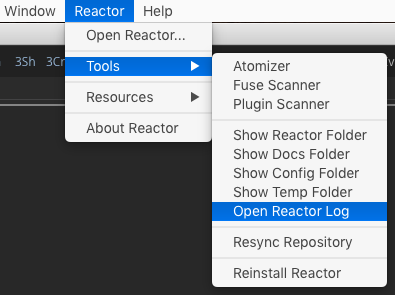
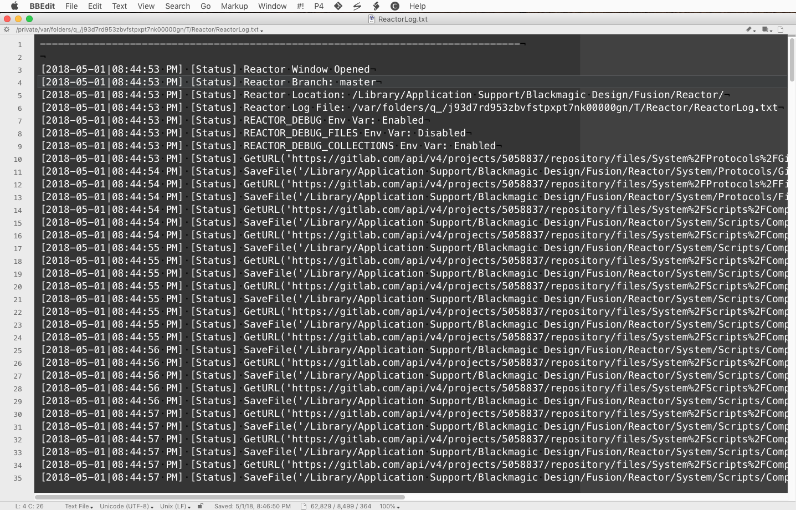
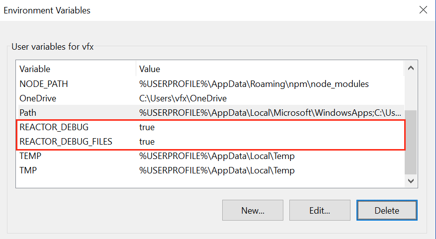

# Table Of Contents #

- [Creating Environment Variables](Creating-Environment-Variables.md)
	- [Reactor Environment Variables](Creating-Environment-Variables.md#reactor-environment-variables)
		- [Viewing the Reactor Log File](Creating-Environment-Variables.md#viewing-the-reactor-log-file)
	- [Using the Windows System Control Panel](Creating-Environment-Variables.md#using-the-windows-system-control-panel)
	- [Using a Linux BASH Profile](Creating-Environment-Variables.md#using-a-linux-bash-profile)
	- [Using MacOS Launch Agent PLIST Files](Creating-Environment-Variables.md#using-macos-launch-agent-plist-files)

# Creating Environment Variables #

## Reactor Environment Variables ##

To see more diagnostic logging detail from the Reactor GUI you can add the `REACTOR_DEBUG` environment variable to your system:

### Reactor Debug ###

The `REACTOR_DEBUG` environment variable can be set to true if you want to see more verbose logging output when you run the Reactor GUI:

`REACTOR_DEBUG=true`

The `REACTOR_DEBUG` environment variable also tells Reactor to provide a status message in the Reactor package manager progress dialog that lists each file as it is being installed. This is handy if you are installing a lot of `Bin` category Reactor atoms that can be hundreds of megabytes in size.

#### Viewing the ReactorLog.txt File ####

When the `REACTOR_DEBUG` environment variable is active it will tell Reactor that you want to have a log file written to `Temp:/Reactor/ReactorLog.txt`. You can quickly open this document by selecting the **Reactor > Tools > Open ReactorLog** menu item:

When you open the `ReactorLog.txt` file in your programmer's text editor it will look something like this:

The first few lines of the log file indicate the state of the Reactor environment variables. Then each of the commands that are used by Reactor to sync files is listed. If the `REACTOR_DEBUG_FILES` environment variable was active you will also see the raw file downloads concatenated inline in the log file too.

### Reactor Debug Files ###

The `REACTOR_DEBUG_FILES` environment variable can be set to true if you want to see Console logging output that shows each of the cURL based file download operations. When the environment variable is set to true Reactor will print the contents of the files as they are downloaded and written to disk. This debugging information is useful for spotting formatting issues and "Error 404" states when a file has trouble successfully downloading from GitLab:

`REACTOR_DEBUG_FILES=true`

### Reactor Debug Collections ###

The `REACTOR_DEBUG_COLLECTIONS` environment variable can be set to true while you are developing and testing atoms that use the Reactor Collections category.

`REACTOR_DEBUG_COLLECTIONS=true`

### Reactor Branch ###

The `REACTOR_BRANCH` environment variable allows you to change the default GitLab branch that is used in the Reactor Installer script, and in the Reactor Package Manager GUI when new content is downloaded and the Reactor utility scripts are updated. When the `REACTOR_BRANCH` environment variable is not specified the "master" branch will be used.

This example would tell Reactor to download content from the "dev" branch:

`REACTOR_BRANCH=dev`

### Reactor Install PathMap ###

The `REACTOR_INSTALL_PATHMAP` environment variable can be used to change the Reactor installation location to something other then the default PathMap value of "AllData:".

`REACTOR_INSTALL_PATHMAP=AllData:`

or

`REACTOR_INSTALL_PATHMAP=UserData:`

or

`REACTOR_INSTALL_PATHMAP=Profile:`

or your own custom Reactor installation location on a local or network path like:

`REACTOR_INSTALL_PATHMAP=E:\Pipeline\Reactor`
`REACTOR_INSTALL_PATHMAP=/Volumes/Pipeline/Reactor`
`REACTOR_INSTALL_PATHMAP=/opt/Reactor`

### Reactor Local System ###

The `REACTOR_LOCAL_SYSTEM` environment variable allows you to do local development of the files in the `Reactor:/System/` folder without needing to git sync each of those revisions with the Reactor GitLab repository.

Whatever folderpath you define in the `REACTOR_LOCAL_SYSTEM` environment variable will be used as a local source of the `Reactor:/System/` folder contents. When you run the **Reactor > Open Reactor...** menu item the `REACTOR_LOCAL_SYSTEM` defined files will be copied automatically to the `Reactor:/System/` folder.

To use this environment variable you need to have a copy of the full Reactor `System` folder with the `Protocols`, `Scripts`, and `UI` folders present along with a copy of the `Reactor.lua` script.

## Using the Windows System Control Panel ##

On Windows the Reactor Branch environment variables can be specified in the **System Control Panel > Advanced System Settings > Environment Variables...** window.

On Windows you can type `set` into the Command Prompt window to see all of the active environment variables on the system.

## Using a Linux BASH Profile ##

If you are on a Linux system you can add your own custom Reactor environment variables by editing your `$HOME/.bash_profile` or `$HOME/.profile`.

You would then add new environment variable entries that look like this:

		export REACTOR_DEBUG_FILES=true
		export REACTOR_DEBUG=true
		export REACTOR_INSTALL_PATHMAP=AllData:
		export REACTOR_LOCAL_SYSTEM=/opt/Reactor/System

On Linux you can type `env` into the Terminal window to see all of the active environment variables on the system.

## Using MacOS Launch Agent PLIST Files ##

On a MacOS system the easiest and most reliable way to setup new environment variables is with the help of LaunchAgent .plist files. If you want to make it easy to visually edit a LaunchAgent plist document you can look at using a 3rd party utility like ["LaunchControl" by Soma-Zone](http://www.soma-zone.com/LaunchControl/).

The Reactor GitLab repository has a copy of some initial Reactor LaunchAgent example .plist files in the folder:

			Bonus/Mac/setenv.reactor.REACTOR_LOCAL_SYSTEM.plist
			Bonus/Mac/setenv.reactor.REACTOR_DEBUG_FILES.plist
			Bonus/Mac/setenv.reactor.REACTOR_BRANCH.plist
			Bonus/Mac/setenv.reactor.REACTOR_DEBUG.plist
			Bonus/Mac/setenv.reactor.REACTOR_INSTALL_PATHMAP.plist

You would need to edit these files in a programmer's text editor to customize them before you install them on your system.

These plist documents are designed to be installed on your MacOS system using root permissions to the folder:

`/Library/LaunchAgents/`

When you go to install the plist files you will need to change the documents to be owned by "root", have the group name of "wheel", and have a Unix "octal" file permission setting of 644.

			sudo chown root /Library/LaunchAgents/setenv.reactor.*.plist
			sudo chgrp wheel /Library/LaunchAgents/setenv.reactor.*.plist
			sudo chmod 644 /Library/LaunchAgents/setenv.reactor.*.plist

You can take a look at the file permissions of the Launch Agent files on your system using the following terminal command:

			ls -la /Library/LaunchAgents/

You will then see a directory listing that looks something like this:

			drwxr-xr-x  24 root  wheel   816 Nov 17 12:28 .
			drwxr-xr-x+ 62 root  wheel  2108 Nov 17 11:59 ..
			-rw-r--r--   1 root  wheel   715 Oct 26  2016 org.macosforge.xquartz.startx.plist
			-rw-r--r--@  1 root  wheel   474 Nov 17 05:42 setenv.reactor.REACTOR_BRANCH.plist
			-rw-r--r--@  1 root  wheel   463 Oct 25 07:25 setenv.reactor.REACTOR_DEBUG.plist
			-rw-r--r--@  1 root  wheel   475 Oct 25 07:27 setenv.reactor.REACTOR_DEBUG_FILES.plist
			-rw-r--r--@  1 root  wheel   473 Dec  7 22:23 setenv.reactor.REACTOR_INSTALL_PATHMAP.plist

On MacOS you can type `env` into the Terminal window to see all of the active environment variables on the system.

Last Revised 2019-05-15
