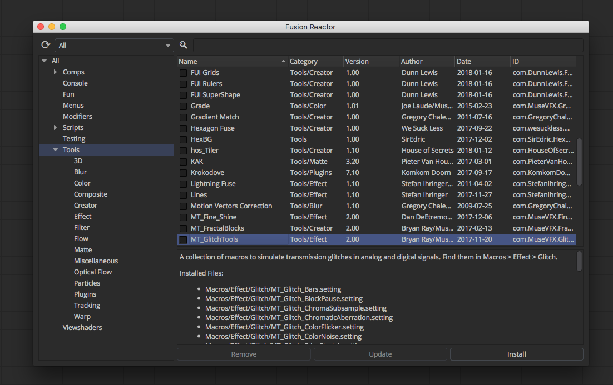

# Reactor Documentation #

## Overview ##
Reactor is a package manager created by the [We Suck Less Community](https://www.steakunderwater.com/wesuckless/viewforum.php?f=32) for Fusion (Free) and Fusion Studio. Reactor streamlines the installation of 3rd party content through the use of "Atom" packages that are synced automatically with a Git repository.

## Table Of Contents ##

- [Overview](#overview)
- [Installing Reactor](Docs/Installing-Reactor.md#installing-reactor)
	- [Installing Reactor Visually](Docs/Installing-Reactor.md#installing-reactor-visually)
	- [Installing Reactor Manually](Docs/Installing-Reactor.md#installing-reactor-manually)
	- [Using Reactor Content on a Render Node](Docs/Installing-Reactor.md#using-reactor-content-on-a-rendernode)
		- [Fusion Render Node Preference File](Docs/Installing-Reactor.md#fusion-render-node-preference-file)
	- [Uninstalling Reactor Manually](Docs/Installing-Reactor.md#uninstalling-reactor-manually)
- [Creating Atom Packages](Docs/Creating-Atom-Packages.md#creating-atom-packages)
	- [Adding a Description to an Atom Package](Docs/Creating-Atom-Packages.md#adding-a-description-to-an-atom-package)
	- [HTML Encoded Entity Characters](Docs/Creating-Atom-Packages.md#html-encoded-entity-characters)
	- [Adding Emoticon Images to the Description](Docs/Creating-Atom-Packages.md#adding-emoticon-images-to-the-description)
	- [Using Atomizer to Edit Your Atoms](Docs/Creating-Atom-Packages.md#using-atomizer-to-edit-your-atoms)
	- [Adding a Category to an Atom Package](Docs/Creating-Atom-Packages.md#adding-a-category-to-an-atom-package)
	- [Adding a Required Donation to an Atom Package](Docs/Creating-Atom-Packages.md#adding-a-required-donation-to-an-atom-package)
		- [PayPal.me Links](Docs/Creating-Atom-Packages.md#paypal-me-links)
		- [WWW Links](Docs/Creating-Atom-Packages.md#www-links)
		- [Email Links](Docs/Creating-Atom-Packages.md#email-links)
		- [Bitcoin Links](Docs/Creating-Atom-Packages.md#bitcoin-links)
	- [Adding a Deploy Platform Requirement](Docs/Creating-Atom-Packages.md#adding-a-deploy-platform-requirement)
		- [Platform Specific Deploy Entries](Docs/Creating-Atom-Packages.md#platform-specific-deploy-entries)
	- [Adding a Package Dependency](Docs/Creating-Atom-Packages.md#adding-a-package-dependency)
	- [Adding Documentation](Docs/Creating-Atom-Packages.md#adding-documentation)
- [Creating Environment Variables](Docs/Creating-Environment-Variables.md)
	- [Reactor Environment Variables](Docs/Creating-Environment-Variables.md#reactor-environment-variables)
	- [Using the Windows System Control Panel](Docs/Creating-Environment-Variables.md#using-the-windows-system-control-panel)
	- [Using a Linux BASH Profile](Docs/Creating-Environment-Variables.md#using-a-linux-bash-profile)
	- [Using MacOS Launch Agent PLIST Files](Docs/Creating-Environment-Variables.md#using-macos-launch-agent-plist-files)

Last Revised 2018-02-16
